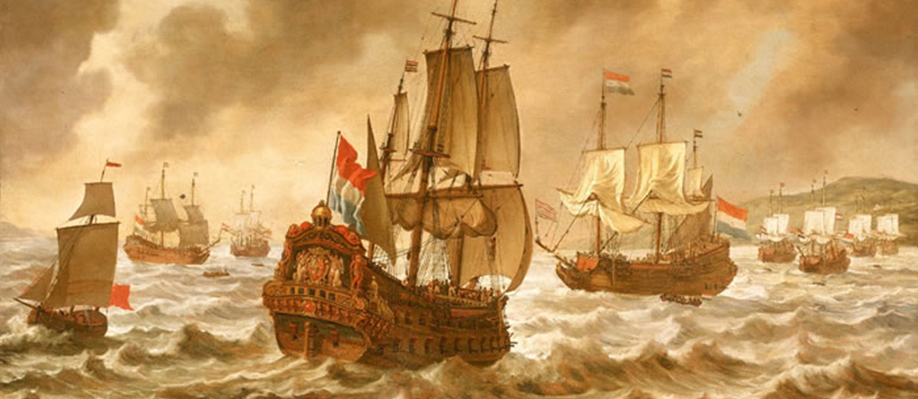
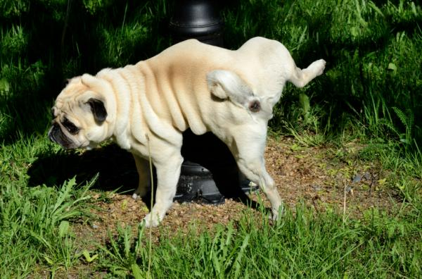
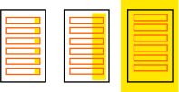

# fuxicadinha PAW0
* 29/05 a 02/06 (semana que vem)
* começa as 15:45
* não há pré requisito

## segunda

* apresentação
    * projeto de extensão
    * rapidinhas
    * -exposição +interação
* WEB como leitura remota de documentos
    * pilha de protocolo
        * cliente-servidor
        * camada física, rede, transporte e aplicação
        * url = protocolo://ip:porta/documento
    * acesso ao servidor local
        * [listagem de diretórios](http://nginxlibrary.com/enable-directory-listing/)
        * index.html
        * imagem.jpg style.css script.js index.pdf
    * firebug / devtools
        * index.html(F12) -> elementos, console, arquivos
        * about:blank

## terça

* html como linguagem de marcação
    * loremipsum.html
        * F12 -> selecionar elementos (ctrl+shift+p)
        * F12 -> inspecionar elementos
            * head
            * body
            * h1
            * p
            * span
    * loremipsum.latex
        * estudo da equivalência das tags
        * latex -> pdf
            * [miktex](https://miktex.org/)
            * [online](https://www.sharelatex.com/)
    * markdown
        * rapidinhaweb1.md (este arqui)
        * [app](https://chrome.google.com/webstore/search/markdown?hl=en)
        * [online](https://stackedit.io/editor)
* html+css
    * por que separar?
    * introdução ao css
        * arquivo style.css
        * class="stl1 stl2 stl3 ..."
        * estilizando pelo F12
        * cor, borda, margem

## quarta

* modelos de interação
    * estático
    * formulário
    * ajax
    * offline
* APIs
    * DOM
    * Banco de Dados
    * Threads (webworker)
    * comunicação
        * xmlhttprequest
        * websocket
        * sse
        * P2P
* fundamentos teóricos
    * assíncrono
    * funcional
